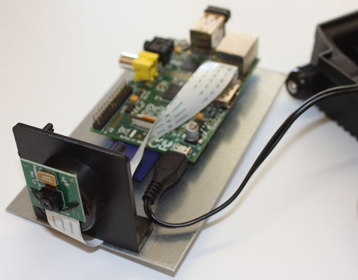

# TrabajosPythonn
# Cámara de vigilancia
.
>[Cámara](https://content.instructables.com/ORIG/FEM/MVMR/HO7X6PPQ/FEMMVMRHO7X6PPQ.jpg?auto=webp&frame=1&fit=bounds&md=fd0e2d8cd125687fdcebdbe307aa4cca)
## Introducción
La seguridad es muy importante en un hogar, una camara de vigilancia puede resultar de gran utilidad en entornos publicos, e incluso privados.
## Materiales
* Raspberri pi modelo B
* Módulo de cámara para Raspberri pi
* Un alojamiento para la cámara
* Fuente de voltaje
* Tarjeta SD
* Conector USB WiFi
## Procedimiento
El procedimiento del proyecto se podrá ver a continuación en el [siguiente link](https://www.instructables.com/Raspberry-Pi-as-low-cost-HD-surveillance-camera/).
## Limitaciones del proyecto
Los costos pueden elevarse
> Scavix de [https://www.scavix.com/en/](Scavix Software GmbH & Co.) dijo
> **That's all: for about US$120 we have all the hardware we need to build this HD surveillance cam.**
El costo podría elevarse a ***464578,80 pesos***.>
Material | Costo (US$)
-------------------------------
Raspberri pi modelo b | 40
-------------------------------
Modulo de cámara | 29 
-------------------------------
Alojamiento | 9
-------------------------------
Fuente de voltaje | 10
-------------------------------
Tarjeta SD | 7 
-------------------------------
Conector USB WiFi | 10
-------------------------------
Total | 105
-------------------------------
## Referencias

// * Al menos dos niveles de títulos #
// * Citas > 
// * Enlaces ()[]
// * Figuras externas por ejemplo de Wikipedia 
// * Tablas |--|--|
// * Negrita y Cursiva Negrita y Cursiva
// * Viñentas  de al menos dos niveles *
// * Enumeraciones 1.
